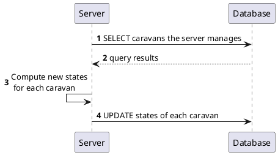
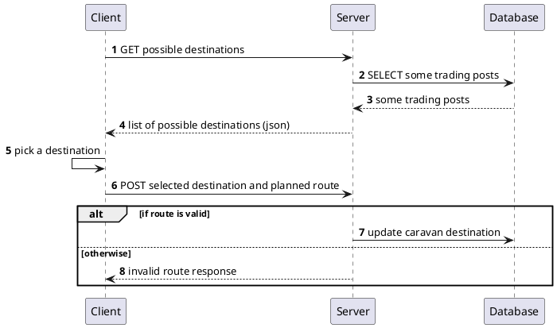
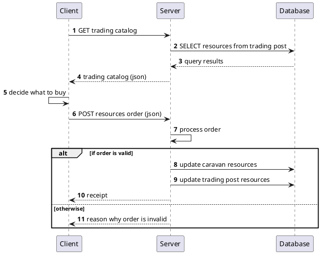
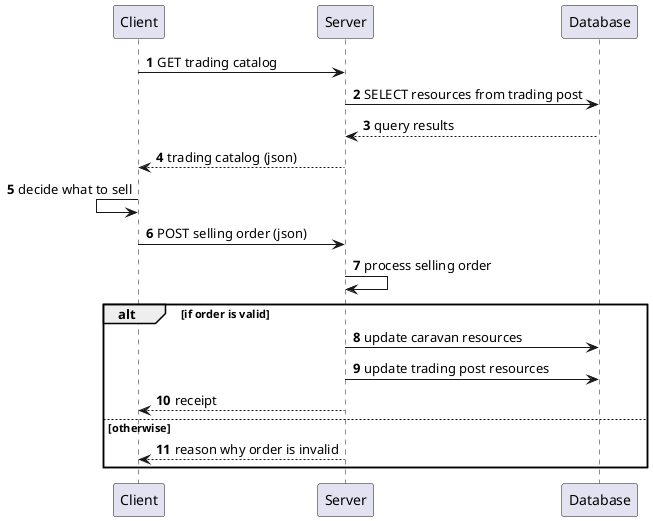

### Server managing the state of its caravans

```plantuml
@startuml
autonumber

participant Server
participant Database

Server -> Database: SELECT caravans the server manages
Database --> Server: query results
Server <- Server: Compute new states\n for each caravan
Server -> Database: UPDATE states of each caravan

@enduml
```

### Client selecting new destination for a caravan

```plantuml
@startuml
autonumber

participant Client
participant Server
participant Database

Client -> Server: GET possible destinations
Server -> Database: SELECT some trading posts
Database --> Server: some trading posts
Server --> Client: list of possible destinations (json)
Client <- Client: pick a destination 
Client -> Server: POST selected destination and planned route

alt if route is valid
    Server -> Database: update caravan destination
else otherwise
    Server --> Client: invalid route response
end

@enduml
```

### Caravan buying resources from trading post

```plantuml
@startuml
autonumber

participant Client
participant Server
participant Database

Client -> Server: GET trading catalog
Server -> Database: SELECT resources from trading post
Database --> Server: query results
Server --> Client: trading catalog (json)
Client <- Client: decide what to buy
Client -> Server: POST resources order (json)
Server -> Server : process order

alt if order is valid
    Server -> Database: update caravan resources
    Server -> Database: update trading post resources
    Server --> Client: receipt
else otherwise
    Server --> Client: reason why order is invalid
end

@enduml
```

### Caravan selling resources to trading post

```plantuml
@startuml
autonumber

participant Client
participant Server
participant Database

Client -> Server: GET trading catalog
Server -> Database: SELECT resources from trading post
Database --> Server: query results
Server --> Client: trading catalog (json)
Client <- Client: decide what to sell
Client -> Server: POST selling order (json)
Server -> Server : process selling order

alt if order is valid
    Server -> Database: update caravan resources
    Server -> Database: update trading post resources
    Server --> Client: receipt
else otherwise
    Server --> Client: reason why order is invalid
end

@enduml
```